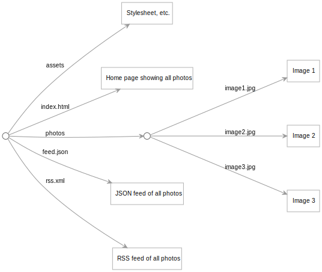

This is a proof-of-concept photo blog based on Google Drive. It takes all the photos in a [publicly-shared folder](https://drive.google.com/drive/folders/14ItmduevPs0MwFvCWHCiyHJicV5S-YTc?usp=sharing) and uses those to build static HTML and image files that can be deployed as a static site.

## Site structure

The overall site structure is defined in [src/site.ori](src/site.ori). For this demo site, all the photos are shown on a single `index.html` page.

The file [src/photos.ori](src/photos.ori) is responsible for authenticating with Google Drive, getting the set of photos from the shared folder, then sorting the photos in reverse chronological order.

## Photo metadata

The caption and dates shown for the photos are extracted from [Exif](https://en.wikipedia.org/wiki/Exif) metadata stored in the photo files. Many photo library and editing applications let you edit the Exif data in a photo.

## Credits

All street art photos ©[Dan Saimo](https://www.instagram.com/saimohaus/) who graciously gave permission to use them in this sample site.

[Asphalt texture](http://wildtextures.com/free-textures/dark-asphalt-seamless-texture/) by Tomasz Grabowiecki

[Souper3 font](https://www.dafont.com/souper3.font) by soup

[Gochi Hand font](https://fonts.google.com/specimen/Gochi+Hand) by Huerta Tipográfica
